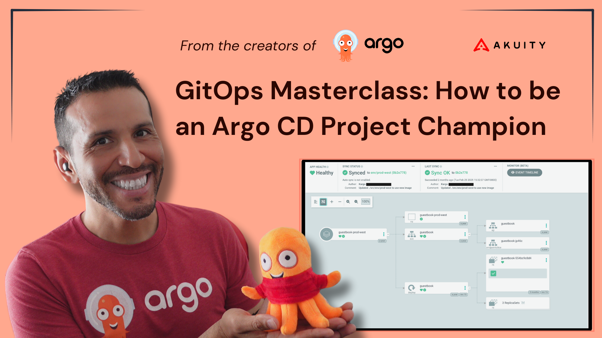

# GitOps Masterclass - Argo CD AppProjects

The accompanying repository for the GitOps Master Class - Argo CD AppProjects 

Argo CD Application Project (AppProject) is a logical grouping mechanism that defines boundaries and access controls for applications within Argo CD. It enables administrators to enforce policies on which Git repositories, Kubernetes namespaces, and Kubernetes Objects applications can manage. 

In this Master Class we’ll be going over: 

* How to best manage the `default` Project 
* Creating and Managing Projects
* Multi-tenancy with Projects using RBAC
* How to Configure Global Projects
* Scoping Clusters and Repositories to specific Projects

To follow along with the video, you can use the following documentation:

* [Getting Started](docs/getting_started.md)
* [Workshop](docs/workshop.md)

## Stuck? Need Help Getting Un-Stuck?
If you have any difficulties during this workshop, [join the Akuity Discord](https://discord.com/invite/dHJBZw6ewT) and ask questions in the **#gitops-masterclass** channel.

