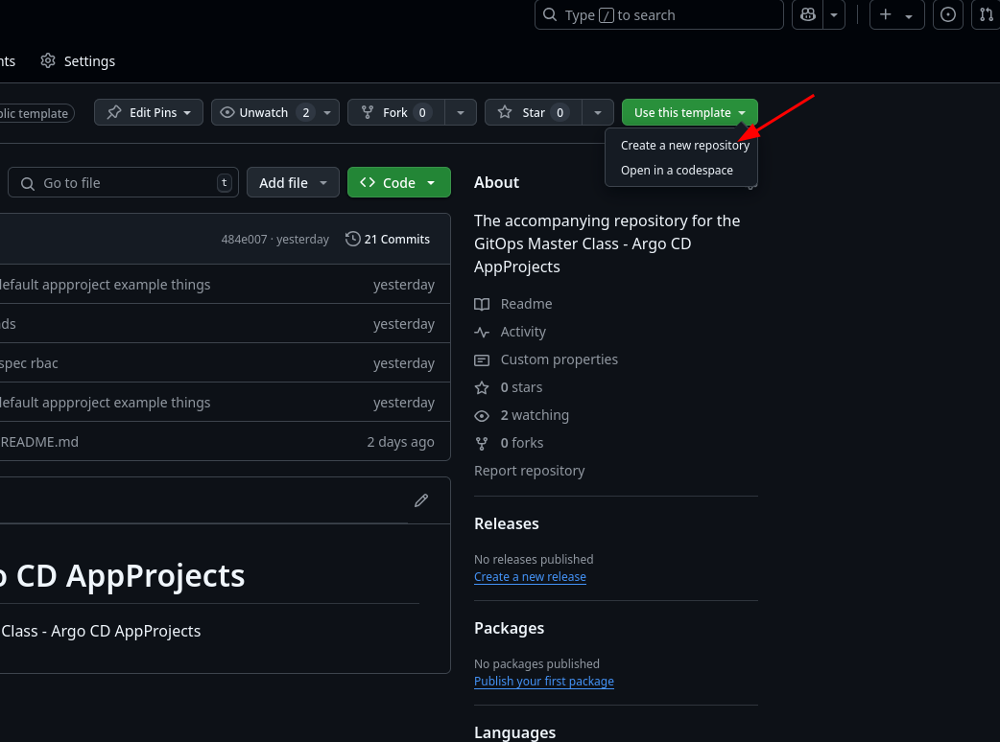
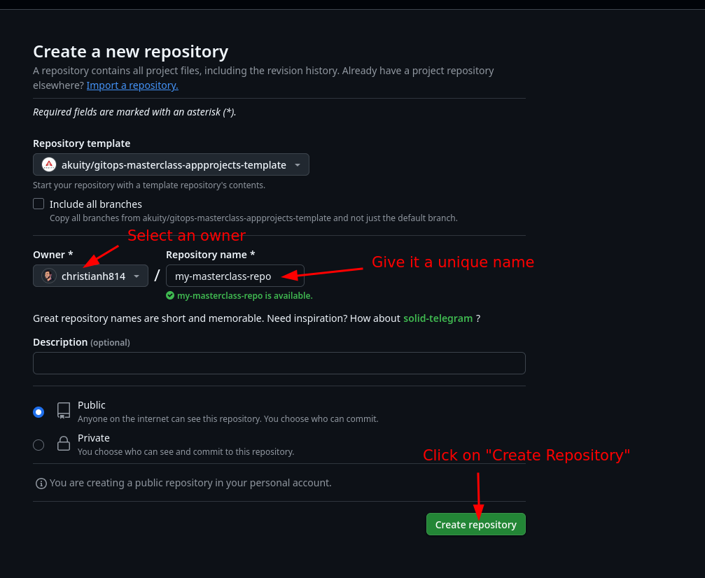
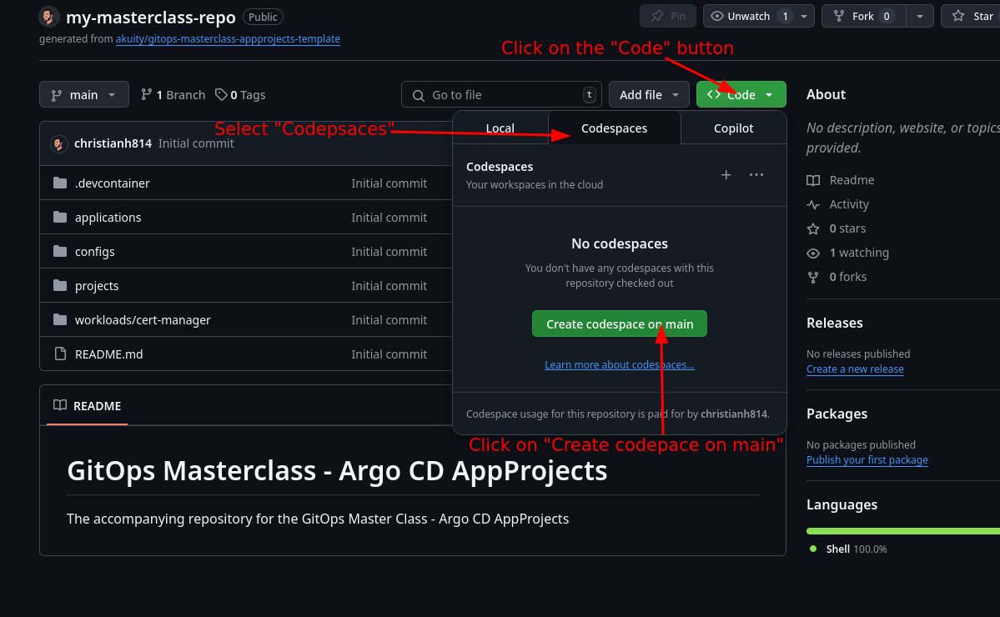
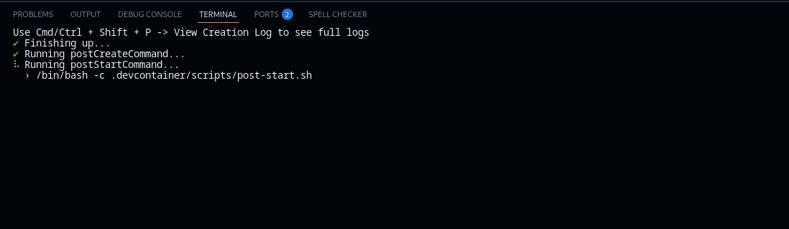
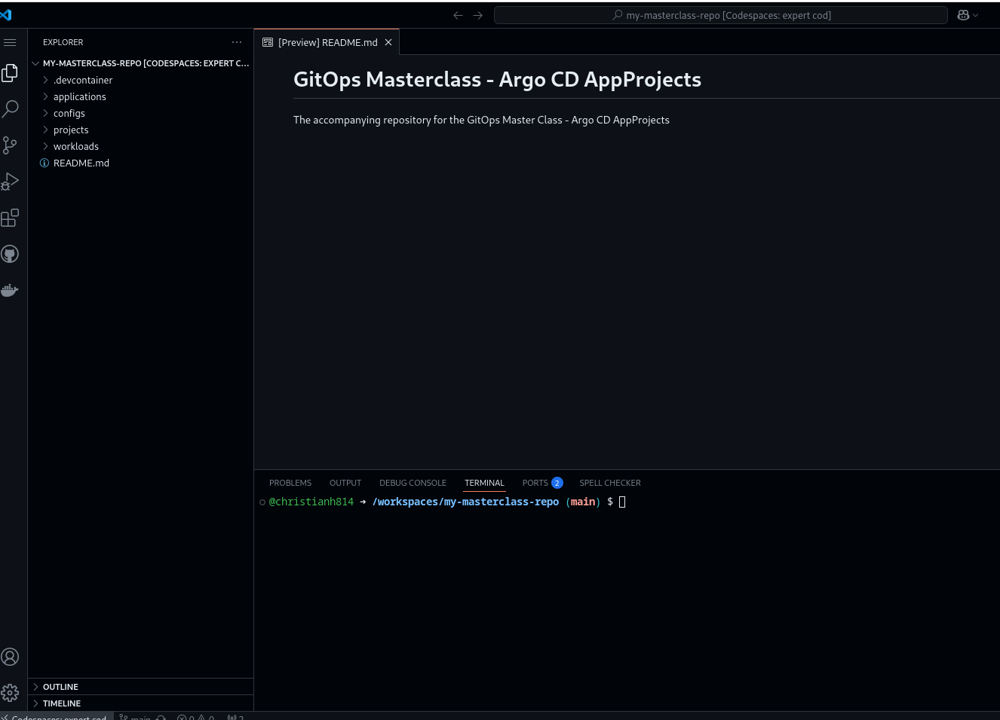
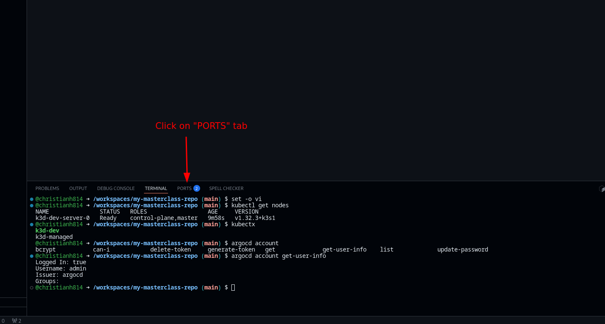
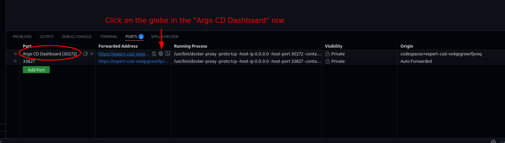
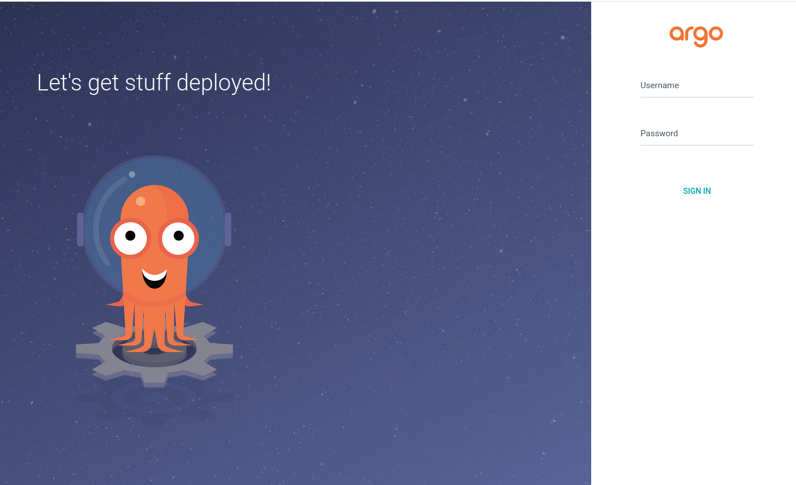

## Using This Repository

This repository makes use of [Codespaces](https://github.com/features/codespaces), the free tier should be sufficent for this as long as you have enough credits.

You start by clicking on "Use this template" on the top right corner  and select "Create a new repository" from the dropdown.



On the "Create a new repository" page, select an "owner" (i.e. your GitHub account), give it a unique name, then click "Create repository"



On your repository that was created from this template, click on the "Code" button on the right, then click on the "Codespaces" tab, then click on "Create codespace on main"



This will launch your Codespace in a new tab. Once it's ready, you'll see a VSCode-like instance with a terminal.

:rotating_light: **DO NOT DO ANYTHING YET** :rotating_light:, it takes about 30ish seconds for the post-setup scripts to finish. You will see the following in your terminal section of your Codespace when the post-setup scripts are running:



Once, the setup scripts are done your terminal prompt will return and your codespace should look something like this:



## Verifying Codespace

Verify the codespace by running the following commands

Ensure Kubernetes is ready by running `kubectl get nodes`

```shell
$ kubectl get nodes 
NAME               STATUS   ROLES                  AGE     VERSION
k3d-dev-server-0   Ready    control-plane,master   9m58s   v1.32.3+k3s1
```

You should have two contexts already set up for you, verify with `kubectx` (the `k3d-dev` context should be $\color{lime}{\textsf{green}}$ )

```shell
$ kubectx
k3d-dev
k3d-managed
```

Verify Argo CD is installed and you're logged in as admin by running `argocd account get-user-info`

```shell
$ argocd account get-user-info 
Logged In: true
Username: admin
Issuer: argocd
Groups: 
```

In the Codespace terminal section click on "PORTS" to view the forwarded ports



In the "PORTS" overview, you'll see a row that says "Argo CD Dashboard", click on the "globe" (🌐) button.



This opens the Argo CD Dashboard in a new tab. You can login with the username `admin` and password of `password`



Once these things have been verified, the Codespace is ready to use for the workshop!