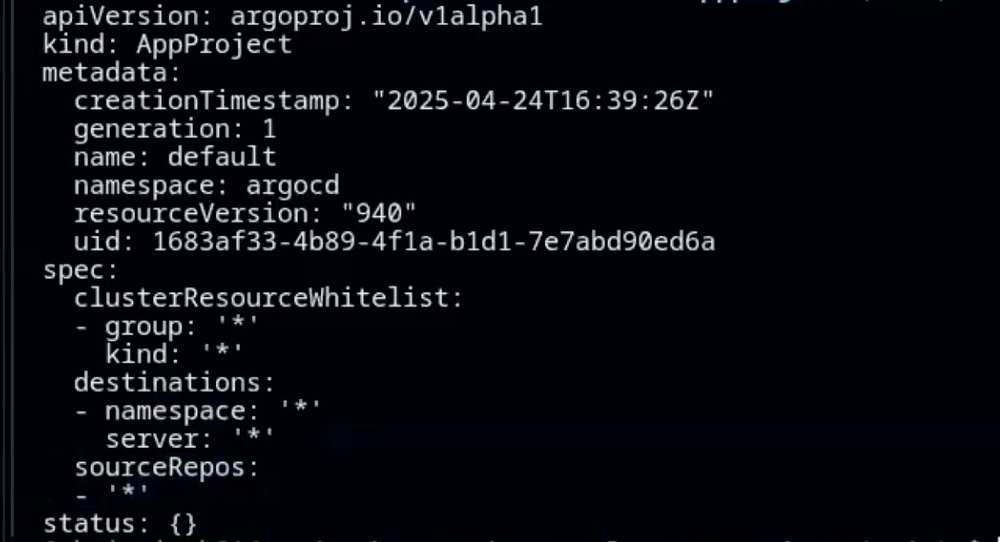
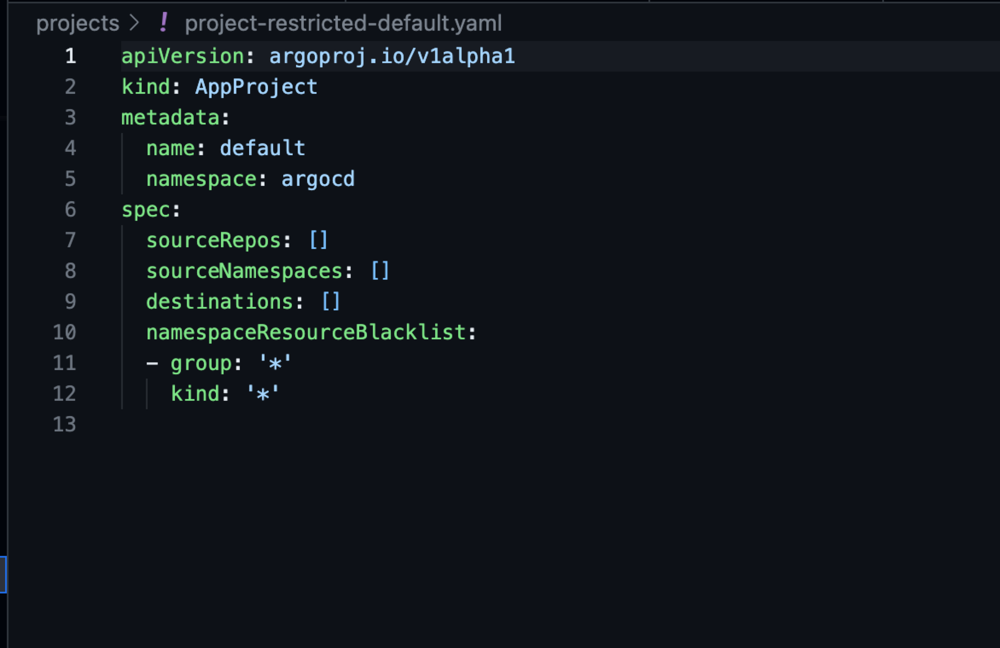

## Masterclass App Projects
Once you've finished getting started, you're ready to start the Workshop.

## All or Nothing? [OPTIONAL]
Let's check our projects.

Input this command in your terminal in your codespace:

```kubectl get appprojects.argoproj.io -n argocd```

An app project has be created for you. It should return a project called 'default.'

Let's check out that YAML. You can check the YAML with this command:

```kubectl get appprojects.argoproj.io -n argocd default -o yaml```

It should return this:



(Note: The asterisk "*" means everything. So this means it will allow everything...which isn't reasonable to do.)

How do we fix this? Navigate to the **projects** folder, and look to the `project-restricted-default.yaml`.



If you take a look, you may notice this: "[ ]" These are what we call **empty sets**. Empty sets mean, as their name suggests, nothing.

### Recap
Asterisk (*): Everything. Means we allow access to everything. Allow everything.

Empty Set ([ ]): Nothing. Means we allow nothing access. Nobody can use this. Deny everything.


## Step 1: Create a Cluster Add-On 
Time to create an add-on for our cluster.

You can achieve this by running this command: ```kubectl create -f projects/project-cluster-addons.yaml```

You can check out your add-on by navigating to the Argo CD UI (check the ports tab next to the terminal tab) and go to **Settings**, then select **Projects**. You should see:
- cluster-addons
- default

If you see these, congratulations! You're ready for the next step.

## Step 2: Cert Manager
In the Argo CD UI, there's an app called **cert-manager**. This app is out of sync! 
Here's how we can fix that:
- Navigate to the **applications** folder. You'll find a file called **app-cert-manager.yaml**. Let's apply this. <br>
Run the command: ```kubectl create -f projects/project-cluster-addons.yaml```
- One line 14, it should say **default**. If you go through with this, it will throw up an error, so let's change that. 
- Change line 14 to say **cluster-addons** instead of default. Reflect these changes. <br>
Run the command ```kubectl replace -f applications/app-cert-manager.yaml``` <br>

If we go back to the Argo CD UI and sync the cert-manager again, it should now show Synced.

## Step 3: Create a User
Let's create a user. To do this, run this command (but make sure you replace "user" in accounts.user with a name): <br>

```kubectl patch -n argocd cm argocd-cm --type='merge' -p='{"data": {"accounts.user": "apiKey, login"}}'```

Then, run this command to switch over to the user you created (replace user with the name you assigned earlier): <br>
```kubectl patch -n argocd cm argocd-cm --type='merge' -p='{"data": accounts.user: "apiKey, login"}}'^C```

Alright, now let's edit the user. Run this command <br>
```kubectl edit -n argocd cm argocd-cm ^C```

Make sure line 7 matches the user you created. Make sure to leave apikey and login as is.
This will map the user data to the config map.

## Step 4: Create a Password

You have a user, but you don't have a password, which is a big problem. Let's run through how to create a password.<br>

You can check out your user info by running this command in your terminal: <br>

```argocd account get-user-info```

You should see something like this: 
- Logged in: true
- Username: admin
- Issuer: argocd
- Groups: 

Let's update the password. Run this command (and be mindful of the username! Replace user with the name you chose): <br>

```argocd account update-password --account=user --new-password=password```

This changes the password to the most memorable password: password.

Now, when you log into the Argo CD UI, use:
- The user account you created's name for the user
- password as the password.

If you navigate to applications...it's all gone? <br>
That is intended. It shows that this user does not have **access**. 
Let's give this user a promotion. The next step will show how to give the user permissions to manage applications.

## Step 5: RBAC, Permissions, Policies
Let's create a workload project that our user can actually access and manage. <br>
Navigate to **projects** folder, and find the YAML file called **project-workloads.yaml**. If you look at lines 22-23, you'll see a lone "p". p stands for **policy**. <br>
The policies listed will allow the user to get projects, get applications, etc.
Check out the documentation for more information: https://argo-cd.readthedocs.io/en/stable/operator-manual/rbac/

- For this step, simply replace "christian" with the user you created on lines **18** and **20**.
- Once you finish that, you need to reflect the change. Run this command in your terminal:
```kubectl create -f projects/project-workloads.yaml```

After applying this change, when you log in as your user on the Argo CD UI, you should be able to see a project in the projects tab called "workloads." There's still another task we need to fulfill. Refer back to the **project-workloads.yaml**, there was a git repository connected to that project. In the next step, we'll create the app.

## Step 6: Simple Go App
You can navigate to the Argo CD UI, to the **Applications Tab**. Create a new application, and select edit as YAML. Delete the current content. <br>
Navigate to your **applications** folder, and find the **app-simple-go.yaml** Copy and paste the whole contents of this YAML into the New Application YAML. Once that's done, hit create.

## Step 7: Create Prod project
Before we create a prod project, let's patch our config map (cm).<br>
To do this, run this command:<br>
```kubectl patch -n argocd cm argocd-cm --patch-file configs/argocd-cm.yaml```<br>
Let's check out the config map and see what changed. Use this command: <br>
```kubectl get -n argocd cm argocd-cm --patch-file configs/argocd-cm.yaml```<br>
You should see something like this: <br>
`  globalProjects: |-
    - labelSelector:
        matchExpressions:
          - key: env
            operator: In
            values:
              - prod
      projectName: global-prod`

Now navigate to your **projects** folder and check out the **project-global.yaml** file. This is our **Global Project**. <br>
This project looks pretty empty (it functions more as a template), so let's fix that.<br>

- Let's create the global project:<br>
```kubectl create -f projects/project-global.yaml```

- Next, create the project *called* prod:<br>
```kubectl create -f projects/project-prod.yaml```
- Let's check to see if our projects were created. Run the command:<br>
```kubectl get appprojects.argoproj.io -n argocd```
You should see global-prod and prod show up.

## Step 8: Scoped Resources/Secrets

### Scoped Repository 
Lastly, we'll talk about how to create scoped resources and secrets. Navigate to your **projects** folder and check out the **project-scoped.yaml**. What we mean by scoping, is that we can assign certain resources such as clusters to specific projects, that no one else can deploy to. That means this project-scoped.yaml only has access to the project called scope. Talk about tunnel vision!
- Let's add this scoped project. Run the command: <br>
```kubectl create -f projects/project-scoped.yaml```
- Let's add the configuration. Run the command: <br>
```kubectl create -f configs/scoped-repo-bgd.yaml```

### How Do I Know My Repository is Scoped?
- Navigate to your Argo CD UI. 
- As your user, you **won't see the scoped project's repository in the repositories tab under settings.**. 
- Log out, and log back in as the **admin** (check out the getting started doc), and you should be able to see the scoped project's repo there. Why? We made the repository a **scoped** resource that only certain users (admin).

### Scoped Clusters
- Verify the cluster is running. Run the command: <br>
```kubectx```
- You should see a cluster called k3d-managed. That's going to become our scoped cluster. How do we do this? We add it to our project with this command:<br>
```argocd cluster add k3d-managed --yes --name managed --project scoped```
- Now apply our bgd scoped app:<br>
```kubectl create -f applications/app-bgd-scoped.yaml```

### How Do I Know My Cluster is Scoped?
- Make sure you're logged in as **admin** in the Argo CD UI.
- You should be able to see the **bgd** app in your applications.
- If you were logged in as the user you created earlier, you wouldn't be able to see it.

### Got Secrets?
For those curious about how to retrieve **secrets**(credentials, etc), here's a quick run through.
- Run the command:<br>
```kubectl get secrets -n argocd```
- Let's say you want to get the secrets for a specific cluster. Run this command:<br>
```kubectl get secrets -n argocd cluster-10.0.0.0.152-3434151765 -o yaml```
You should see your cluster's secrets here. You can see where the project is **scoped** in the project field under name.


# Conclusion
That wraps up the steps for participating in the GitOps masterclass! Thank you so much for taking the time to try the workshop out. 
Remember, if you have any difficulties during this workshop, [join the Akuity Discord](https://discord.com/invite/dHJBZw6ewT) and ask questions in the **#gitops-masterclass** channel.